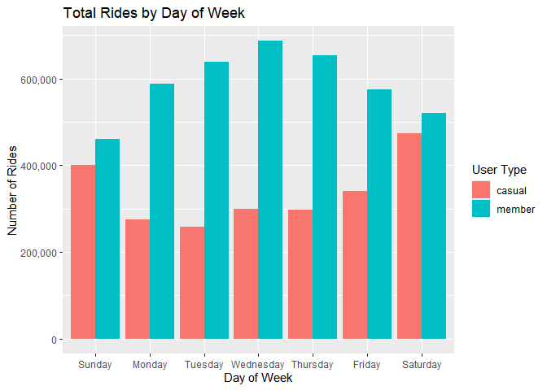
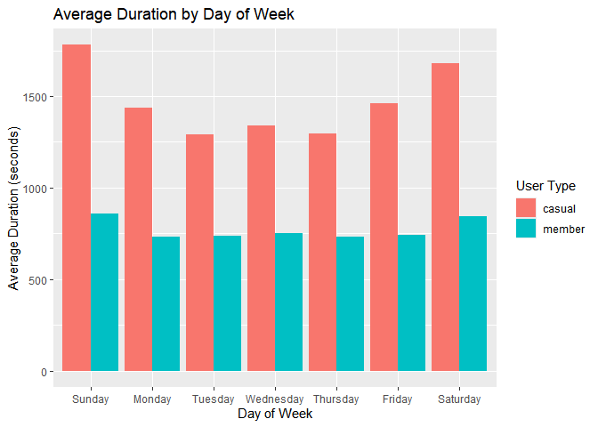

Lyft Bikes Analysis
================

``` r
# To wrangle data
library(tidyverse)

# To manage conflicts
library(conflicted)

# Set dplyr::filter and dplyr::lag as the default choices
conflict_prefer("filter", "dplyr")
conflict_prefer("lag", "dplyr")

# To recognize scales
library(scales)

# Use the readxl package to read xlsx files
library(readxl)

# Upload datasets (xlsx files)
trip_10_2023 <- read_xlsx("202310-divvy-tripdata.xlsx")
trip_11_2023 <- read_xlsx("202311-divvy-tripdata.xlsx")
trip_12_2023 <- read_xlsx("202312-divvy-tripdata.xlsx")
trip_1_2024 <- read_xlsx("202401-divvy-tripdata.xlsx")
trip_2_2024 <- read_xlsx("202402-divvy-tripdata.xlsx")
trip_3_2024 <- read_xlsx("202403-divvy-tripdata.xlsx")
trip_4_2024 <- read_xlsx("202404-divvy-tripdata.xlsx")
trip_5_2024 <- read_xlsx("202405-divvy-tripdata.xlsx")
trip_6_2024 <- read_xlsx("202406-divvy-tripdata.xlsx")
trip_7_2024 <- read_xlsx("202407-divvy-tripdata.xlsx")
trip_8_2024 <- read_xlsx("202408-divvy-tripdata.xlsx")
trip_9_2024 <- read_xlsx("202409-divvy-tripdata.xlsx")
trip_10_2024 <- read_xlsx("202410-divvy-tripdata.xlsx")

# Inspect the dataframes and look for incongruencies
str(trip_10_2023)
```

    ## tibble [537,113 × 15] (S3: tbl_df/tbl/data.frame)
    ##  $ ride_id           : chr [1:537113] "4449097279F8BBE7" "9CF060543CA7B439" "667F21F4D6BDE69C" "F92714CC6B019B96" ...
    ##  $ rideable_type     : chr [1:537113] "classic_bike" "electric_bike" "electric_bike" "classic_bike" ...
    ##  $ started_at        : POSIXct[1:537113], format: "2023-10-08 10:36:26" "2023-10-11 17:23:59" ...
    ##  $ ended_at          : POSIXct[1:537113], format: "2023-10-08 10:49:19" "2023-10-11 17:36:08" ...
    ##  $ start_station_name: chr [1:537113] "Orleans St & Chestnut St (NEXT Apts)" "Desplaines St & Kinzie St" "Orleans St & Chestnut St (NEXT Apts)" "Desplaines St & Kinzie St" ...
    ##  $ start_station_id  : chr [1:537113] "620" "TA1306000003" "620" "TA1306000003" ...
    ##  $ end_station_name  : chr [1:537113] "Sheffield Ave & Webster Ave" "Sheffield Ave & Webster Ave" "Franklin St & Lake St" "Franklin St & Lake St" ...
    ##  $ end_station_id    : chr [1:537113] "TA1309000033" "TA1309000033" "TA1307000111" "TA1307000111" ...
    ##  $ start_lat         : num [1:537113] 41.9 41.9 41.9 41.9 41.9 ...
    ##  $ start_lng         : num [1:537113] -87.6 -87.6 -87.6 -87.6 -87.6 ...
    ##  $ end_lat           : num [1:537113] 41.9 41.9 41.9 41.9 41.9 ...
    ##  $ end_lng           : num [1:537113] -87.7 -87.7 -87.6 -87.6 -87.6 ...
    ##  $ member_casual     : chr [1:537113] "member" "member" "member" "member" ...
    ##  $ ride_length       : num [1:537113] 0.00895 0.00844 0.00301 0.00377 0.00799 ...
    ##  $ day_of_week       : num [1:537113] 1 4 5 3 2 4 3 2 3 3 ...

``` r
str(trip_11_2023)
```

    ## tibble [362,518 × 15] (S3: tbl_df/tbl/data.frame)
    ##  $ ride_id           : chr [1:362518] "4EAD8F1AD547356B" "6322270563BF5470" "B37BDE091ECA38E0" "CF0CA5DD26E4F90E" ...
    ##  $ rideable_type     : chr [1:362518] "electric_bike" "electric_bike" "electric_bike" "classic_bike" ...
    ##  $ started_at        : POSIXct[1:362518], format: "2023-11-30 21:50:05" "2023-11-03 09:44:02" ...
    ##  $ ended_at          : POSIXct[1:362518], format: "2023-11-30 22:13:27" "2023-11-03 10:17:15" ...
    ##  $ start_station_name: chr [1:362518] "Millennium Park" "Broadway & Sheridan Rd" "State St & Pearson St" "Theater on the Lake" ...
    ##  $ start_station_id  : chr [1:362518] "13008" "13323" "TA1307000061" "TA1308000001" ...
    ##  $ end_station_name  : chr [1:362518] "Pine Grove Ave & Waveland Ave" "Broadway & Sheridan Rd" "State St & Pearson St" "Theater on the Lake" ...
    ##  $ end_station_id    : chr [1:362518] "TA1307000150" "13323" "TA1307000061" "TA1308000001" ...
    ##  $ start_lat         : num [1:362518] 41.9 42 41.9 41.9 41.9 ...
    ##  $ start_lng         : num [1:362518] -87.6 -87.7 -87.6 -87.6 -87.6 ...
    ##  $ end_lat           : num [1:362518] 41.9 42 41.9 41.9 41.9 ...
    ##  $ end_lng           : num [1:362518] -87.6 -87.6 -87.6 -87.6 -87.6 ...
    ##  $ member_casual     : chr [1:362518] "member" "member" "member" "member" ...
    ##  $ ride_length       : num [1:362518] 0.016227 0.023067 0.000278 0.017593 0.023611 ...
    ##  $ day_of_week       : num [1:362518] 5 6 5 4 6 5 5 1 1 5 ...

``` r
str(trip_12_2023)
```

    ## tibble [224,073 × 15] (S3: tbl_df/tbl/data.frame)
    ##  $ ride_id           : chr [1:224073] "C9BD54F578F57246" "CDBD92F067FA620E" "ABC0858E52CBFC84" "F44B6F0E8F76DC90" ...
    ##  $ rideable_type     : chr [1:224073] "electric_bike" "electric_bike" "electric_bike" "electric_bike" ...
    ##  $ started_at        : POSIXct[1:224073], format: "2023-12-02 18:44:01" "2023-12-02 18:48:19" ...
    ##  $ ended_at          : POSIXct[1:224073], format: "2023-12-02 18:47:51" "2023-12-02 18:54:48" ...
    ##  $ start_station_name: chr [1:224073] NA NA NA NA ...
    ##  $ start_station_id  : chr [1:224073] NA NA NA NA ...
    ##  $ end_station_name  : chr [1:224073] NA NA NA NA ...
    ##  $ end_station_id    : chr [1:224073] NA NA NA NA ...
    ##  $ start_lat         : num [1:224073] 41.9 41.9 41.9 42 41.9 ...
    ##  $ start_lng         : num [1:224073] -87.7 -87.7 -87.6 -87.7 -87.6 ...
    ##  $ end_lat           : num [1:224073] 41.9 41.9 41.9 41.9 41.9 ...
    ##  $ end_lng           : num [1:224073] -87.7 -87.6 -87.6 -87.7 -87.6 ...
    ##  $ member_casual     : chr [1:224073] "member" "member" "member" "member" ...
    ##  $ ride_length       : num [1:224073] 0.00266 0.0045 0.00529 0.00338 0.00117 ...
    ##  $ day_of_week       : num [1:224073] 7 7 1 1 1 1 1 1 2 1 ...

``` r
str(trip_1_2024)
```

    ## tibble [144,873 × 15] (S3: tbl_df/tbl/data.frame)
    ##  $ ride_id           : chr [1:144873] "C1D650626C8C899A" "EECD38BDB25BFCB0" "F4A9CE78061F17F7" "0A0D9E15EE50B171" ...
    ##  $ rideable_type     : chr [1:144873] "electric_bike" "electric_bike" "electric_bike" "classic_bike" ...
    ##  $ started_at        : POSIXct[1:144873], format: "2024-01-12 15:30:27" "2024-01-08 15:45:46" ...
    ##  $ ended_at          : POSIXct[1:144873], format: "2024-01-12 15:37:59" "2024-01-08 15:52:59" ...
    ##  $ start_station_name: chr [1:144873] "Wells St & Elm St" "Wells St & Elm St" "Wells St & Elm St" "Wells St & Randolph St" ...
    ##  $ start_station_id  : chr [1:144873] "KA1504000135" "KA1504000135" "KA1504000135" "TA1305000030" ...
    ##  $ end_station_name  : chr [1:144873] "Kingsbury St & Kinzie St" "Kingsbury St & Kinzie St" "Kingsbury St & Kinzie St" "Larrabee St & Webster Ave" ...
    ##  $ end_station_id    : chr [1:144873] "KA1503000043" "KA1503000043" "KA1503000043" "13193" ...
    ##  $ start_lat         : num [1:144873] 41.9 41.9 41.9 41.9 41.9 ...
    ##  $ start_lng         : num [1:144873] -87.6 -87.6 -87.6 -87.6 -87.7 ...
    ##  $ end_lat           : num [1:144873] 41.9 41.9 41.9 41.9 41.9 ...
    ##  $ end_lng           : num [1:144873] -87.6 -87.6 -87.6 -87.6 -87.6 ...
    ##  $ member_casual     : chr [1:144873] "member" "member" "member" "member" ...
    ##  $ ride_length       : num [1:144873] 0.00523 0.00501 0.00556 0.02071 0.01819 ...
    ##  $ day_of_week       : num [1:144873] 6 2 7 2 4 1 6 5 2 4 ...

``` r
str(trip_2_2024)
```

    ## tibble [223,164 × 15] (S3: tbl_df/tbl/data.frame)
    ##  $ ride_id           : chr [1:223164] "FCB05EB1758F85E8" "7FB986AD5D3DE9D6" "40CA13E15B5B470D" "D47A1660919E8861" ...
    ##  $ rideable_type     : chr [1:223164] "classic_bike" "classic_bike" "electric_bike" "classic_bike" ...
    ##  $ started_at        : POSIXct[1:223164], format: "2024-02-03 14:14:18" "2024-02-05 21:10:06" ...
    ##  $ ended_at          : POSIXct[1:223164], format: "2024-02-03 14:21:00" "2024-02-05 21:15:44" ...
    ##  $ start_station_name: chr [1:223164] "Clark St & Newport St" "Michigan Ave & Washington St" "Leavitt St & Armitage Ave" "Southport Ave & Waveland Ave" ...
    ##  $ start_station_id  : chr [1:223164] "632" "13001" "TA1309000029" "13235" ...
    ##  $ end_station_name  : chr [1:223164] "Southport Ave & Waveland Ave" "Wabash Ave & Grand Ave" "Milwaukee Ave & Wabansia Ave" "Southport Ave & Belmont Ave" ...
    ##  $ end_station_id    : chr [1:223164] "13235" "TA1307000117" "13243" "13229" ...
    ##  $ start_lat         : num [1:223164] 41.9 41.9 41.9 41.9 41.8 ...
    ##  $ start_lng         : num [1:223164] -87.7 -87.6 -87.7 -87.7 -87.6 ...
    ##  $ end_lat           : num [1:223164] 41.9 41.9 41.9 41.9 41.8 ...
    ##  $ end_lng           : num [1:223164] -87.7 -87.6 -87.7 -87.7 -87.6 ...
    ##  $ member_casual     : chr [1:223164] "member" "member" "member" "member" ...
    ##  $ ride_length       : num [1:223164] 0.00465 0.00391 0.00125 0.00266 0.00582 ...
    ##  $ day_of_week       : num [1:223164] 7 2 2 5 4 6 1 5 5 2 ...

``` r
str(trip_3_2024)
```

    ## tibble [301,687 × 15] (S3: tbl_df/tbl/data.frame)
    ##  $ ride_id           : chr [1:301687] "64FBE3BAED5F29E6" "9991629435C5E20E" "E5C9FECD5B71BEBD" "4CEA3EC8906DAEA8" ...
    ##  $ rideable_type     : chr [1:301687] "electric_bike" "electric_bike" "electric_bike" "electric_bike" ...
    ##  $ started_at        : POSIXct[1:301687], format: "2024-03-05 18:33:11" "2024-03-06 17:15:14" ...
    ##  $ ended_at          : POSIXct[1:301687], format: "2024-03-05 18:51:48" "2024-03-06 17:16:04" ...
    ##  $ start_station_name: chr [1:301687] NA NA NA NA ...
    ##  $ start_station_id  : chr [1:301687] NA NA NA NA ...
    ##  $ end_station_name  : chr [1:301687] NA NA NA NA ...
    ##  $ end_station_id    : chr [1:301687] NA NA NA NA ...
    ##  $ start_lat         : num [1:301687] 41.9 41.9 41.9 41.9 41.9 ...
    ##  $ start_lng         : num [1:301687] -87.7 -87.6 -87.6 -87.6 -87.7 ...
    ##  $ end_lat           : num [1:301687] 42 41.9 41.9 41.9 41.9 ...
    ##  $ end_lng           : num [1:301687] -87.7 -87.6 -87.6 -87.6 -87.7 ...
    ##  $ member_casual     : chr [1:301687] "member" "member" "member" "member" ...
    ##  $ ride_length       : num [1:301687] 0.012928 0.000579 0.001991 0.001551 0.011111 ...
    ##  $ day_of_week       : num [1:301687] 3 4 4 1 1 6 6 6 2 6 ...

``` r
str(trip_4_2024)
```

    ## tibble [415,025 × 15] (S3: tbl_df/tbl/data.frame)
    ##  $ ride_id           : chr [1:415025] "743252713F32516B" "BE90D33D2240C614" "D47BBDDE7C40DD61" "6684E760BF9EA9B5" ...
    ##  $ rideable_type     : chr [1:415025] "classic_bike" "electric_bike" "classic_bike" "classic_bike" ...
    ##  $ started_at        : POSIXct[1:415025], format: "2024-04-22 19:08:21" "2024-04-11 06:19:24" ...
    ##  $ ended_at          : POSIXct[1:415025], format: "2024-04-22 19:12:56" "2024-04-11 06:22:21" ...
    ##  $ start_station_name: chr [1:415025] "Aberdeen St & Jackson Blvd" "Aberdeen St & Jackson Blvd" "Sheridan Rd & Montrose Ave" "Aberdeen St & Jackson Blvd" ...
    ##  $ start_station_id  : chr [1:415025] "13157" "13157" "TA1307000107" "13157" ...
    ##  $ end_station_name  : chr [1:415025] "Desplaines St & Jackson Blvd" "Desplaines St & Jackson Blvd" "Ashland Ave & Belle Plaine Ave" "Desplaines St & Jackson Blvd" ...
    ##  $ end_station_id    : chr [1:415025] "15539" "15539" "13249" "15539" ...
    ##  $ start_lat         : num [1:415025] 41.9 41.9 42 41.9 42 ...
    ##  $ start_lng         : num [1:415025] -87.7 -87.7 -87.7 -87.7 -87.7 ...
    ##  $ end_lat           : num [1:415025] 41.9 41.9 42 41.9 41.9 ...
    ##  $ end_lng           : num [1:415025] -87.6 -87.6 -87.7 -87.6 -87.6 ...
    ##  $ member_casual     : chr [1:415025] "member" "member" "member" "member" ...
    ##  $ ride_length       : num [1:415025] 0.00318 0.00205 0.01132 0.00262 0.02595 ...
    ##  $ day_of_week       : num [1:415025] 2 5 7 5 6 4 4 5 3 7 ...

``` r
str(trip_5_2024)
```

    ## tibble [609,493 × 15] (S3: tbl_df/tbl/data.frame)
    ##  $ ride_id           : chr [1:609493] "7D9F0CE9EC2A1297" "02EC47687411416F" "101370FB2D3402BE" "E97E396331ED6913" ...
    ##  $ rideable_type     : chr [1:609493] "classic_bike" "classic_bike" "classic_bike" "electric_bike" ...
    ##  $ started_at        : POSIXct[1:609493], format: "2024-05-25 15:52:42" "2024-05-14 15:11:51" ...
    ##  $ ended_at          : POSIXct[1:609493], format: "2024-05-25 16:11:50" "2024-05-14 15:22:00" ...
    ##  $ start_station_name: chr [1:609493] "Streeter Dr & Grand Ave" "Sheridan Rd & Greenleaf Ave" "Streeter Dr & Grand Ave" "Streeter Dr & Grand Ave" ...
    ##  $ start_station_id  : chr [1:609493] "13022" "KA1504000159" "13022" "13022" ...
    ##  $ end_station_name  : chr [1:609493] "Clark St & Elm St" "Sheridan Rd & Loyola Ave" "Wabash Ave & 9th St" "Sheffield Ave & Wellington Ave" ...
    ##  $ end_station_id    : chr [1:609493] "TA1307000039" "RP-009" "TA1309000010" "TA1307000052" ...
    ##  $ start_lat         : num [1:609493] 41.9 42 41.9 41.9 41.9 ...
    ##  $ start_lng         : num [1:609493] -87.6 -87.7 -87.6 -87.6 -87.6 ...
    ##  $ end_lat           : num [1:609493] 41.9 42 41.9 41.9 41.9 ...
    ##  $ end_lng           : num [1:609493] -87.6 -87.7 -87.6 -87.7 -87.6 ...
    ##  $ member_casual     : chr [1:609493] "casual" "casual" "member" "member" ...
    ##  $ ride_length       : num [1:609493] 0.01329 0.00705 0.01611 0.01294 0.00468 ...
    ##  $ day_of_week       : num [1:609493] 7 3 5 6 4 7 6 1 1 2 ...

``` r
str(trip_6_2024)
```

    ## tibble [710,721 × 15] (S3: tbl_df/tbl/data.frame)
    ##  $ ride_id           : chr [1:710721] "CDE6023BE6B11D2F" "462B48CD292B6A18" "9CFB6A858D23ABF7" "6365EFEB64231153" ...
    ##  $ rideable_type     : chr [1:710721] "electric_bike" "electric_bike" "electric_bike" "electric_bike" ...
    ##  $ started_at        : chr [1:710721] "2024-06-11 17:20:06" "2024-06-11 17:19:21" "2024-06-11 17:25:27" "2024-06-11 11:53:50" ...
    ##  $ ended_at          : chr [1:710721] "2024-06-11 17:21:39" "2024-06-11 17:19:36" "2024-06-11 17:30:13" "2024-06-11 12:08:13" ...
    ##  $ start_station_name: chr [1:710721] NA NA NA NA ...
    ##  $ start_station_id  : chr [1:710721] NA NA NA NA ...
    ##  $ end_station_name  : chr [1:710721] NA NA NA NA ...
    ##  $ end_station_id    : num [1:710721] NA NA NA NA NA NA NA NA NA NA ...
    ##  $ start_lat         : num [1:710721] 41.9 41.9 41.9 41.9 41.9 ...
    ##  $ start_lng         : num [1:710721] -87.7 -87.7 -87.7 -87.6 -87.6 ...
    ##  $ end_lat           : num [1:710721] 41.9 41.9 41.9 41.9 41.9 ...
    ##  $ end_lng           : num [1:710721] -87.7 -87.7 -87.7 -87.6 -87.6 ...
    ##  $ member_casual     : chr [1:710721] "casual" "casual" "casual" "casual" ...
    ##  $ ride_length       : num [1:710721] 0.001076 0.000174 0.00331 0.009988 0.000162 ...
    ##  $ day_of_week       : num [1:710721] 3 3 3 3 3 3 3 3 3 3 ...

``` r
str(trip_7_2024)
```

    ## tibble [748,962 × 15] (S3: tbl_df/tbl/data.frame)
    ##  $ ride_id           : chr [1:748962] "2658E319B13141F9" "B2176315168A47CE" "C2A9D33DF7EBB422" "8BFEA406DF01D8AD" ...
    ##  $ rideable_type     : chr [1:748962] "electric_bike" "electric_bike" "electric_bike" "electric_bike" ...
    ##  $ started_at        : chr [1:748962] "2024-07-11 08:15:14" "2024-07-11 15:45:07" "2024-07-11 08:24:48" "2024-07-11 08:46:06" ...
    ##  $ ended_at          : chr [1:748962] "2024-07-11 08:17:56" "2024-07-11 16:06:04" "2024-07-11 08:28:05" "2024-07-11 09:14:11" ...
    ##  $ start_station_name: chr [1:748962] NA NA NA NA ...
    ##  $ start_station_id  : chr [1:748962] NA NA NA NA ...
    ##  $ end_station_name  : chr [1:748962] NA NA NA NA ...
    ##  $ end_station_id    : chr [1:748962] NA NA NA NA ...
    ##  $ start_lat         : num [1:748962] 41.8 41.8 41.8 41.9 42 ...
    ##  $ start_lng         : num [1:748962] -87.6 -87.6 -87.6 -87.6 -87.6 ...
    ##  $ end_lat           : num [1:748962] 41.8 41.8 41.8 41.9 41.9 ...
    ##  $ end_lng           : num [1:748962] -87.6 -87.6 -87.6 -87.7 -87.6 ...
    ##  $ member_casual     : chr [1:748962] "casual" "casual" "casual" "casual" ...
    ##  $ ride_length       : num [1:748962] 0.00188 0.01455 0.00228 0.0195 0.00838 ...
    ##  $ day_of_week       : num [1:748962] 5 5 5 5 5 5 5 5 5 4 ...

``` r
str(trip_8_2024)
```

    ## tibble [755,639 × 15] (S3: tbl_df/tbl/data.frame)
    ##  $ ride_id           : chr [1:755639] "BAA154388A869E64" "8752245932EFF67A" "44DDF9F57A9A161F" "44AAAF069B0C78C3" ...
    ##  $ rideable_type     : chr [1:755639] "classic_bike" "electric_bike" "classic_bike" "electric_bike" ...
    ##  $ started_at        : chr [1:755639] "2024-08-02 13:35:14" "2024-08-02 15:33:13" "2024-08-16 15:44:06" "2024-08-19 18:47:11" ...
    ##  $ ended_at          : chr [1:755639] "2024-08-02 13:48:24" "2024-08-02 15:55:23" "2024-08-16 15:57:52" "2024-08-19 18:56:33" ...
    ##  $ start_station_name: chr [1:755639] "State St & Randolph St" "Franklin St & Monroe St" "Franklin St & Monroe St" "Clark St & Elm St" ...
    ##  $ start_station_id  : chr [1:755639] "TA1305000029" "TA1309000007" "TA1309000007" "TA1307000039" ...
    ##  $ end_station_name  : chr [1:755639] "Wabash Ave & 9th St" "Damen Ave & Cortland St" "Clark St & Elm St" "McClurg Ct & Ohio St" ...
    ##  $ end_station_id    : chr [1:755639] "TA1309000010" "13133" "TA1307000039" "TA1306000029" ...
    ##  $ start_lat         : num [1:755639] 41.9 41.9 41.9 41.9 42 ...
    ##  $ start_lng         : num [1:755639] -87.6 -87.6 -87.6 -87.6 -87.7 ...
    ##  $ end_lat           : num [1:755639] 41.9 41.9 41.9 41.9 42 ...
    ##  $ end_lng           : num [1:755639] -87.6 -87.7 -87.6 -87.6 -87.7 ...
    ##  $ member_casual     : chr [1:755639] "member" "member" "member" "member" ...
    ##  $ ride_length       : num [1:755639] 0.00914 0.01539 0.00956 0.0065 0.00844 ...
    ##  $ day_of_week       : num [1:755639] 6 6 6 2 7 7 4 3 3 3 ...

``` r
str(trip_9_2024)
```

    ## tibble [821,276 × 15] (S3: tbl_df/tbl/data.frame)
    ##  $ ride_id           : chr [1:821276] "31D38723D5A8665A" "67CB39987F4E895B" "DA61204FD26EC681" "06F160D46AF235DD" ...
    ##  $ rideable_type     : chr [1:821276] "electric_bike" "electric_bike" "electric_bike" "electric_bike" ...
    ##  $ started_at        : chr [1:821276] "2024-09-26 15:30:58" "2024-09-26 15:31:32" "2024-09-26 15:00:33" "2024-09-26 18:19:06" ...
    ##  $ ended_at          : chr [1:821276] "2024-09-26 15:30:59" "2024-09-26 15:53:13" "2024-09-26 15:02:25" "2024-09-26 18:38:53" ...
    ##  $ start_station_name: chr [1:821276] NA NA NA NA ...
    ##  $ start_station_id  : chr [1:821276] NA NA NA NA ...
    ##  $ end_station_name  : chr [1:821276] NA NA NA NA ...
    ##  $ end_station_id    : chr [1:821276] NA NA NA NA ...
    ##  $ start_lat         : num [1:821276] 41.9 41.9 41.9 41.9 41.9 ...
    ##  $ start_lng         : num [1:821276] -87.6 -87.6 -87.6 -87.6 -87.7 ...
    ##  $ end_lat           : num [1:821276] 41.9 41.9 41.9 41.9 41.9 ...
    ##  $ end_lng           : num [1:821276] -87.6 -87.6 -87.6 -87.6 -87.6 ...
    ##  $ member_casual     : chr [1:821276] "member" "member" "member" "member" ...
    ##  $ ride_length       : num [1:821276] 1.16e-05 1.51e-02 1.30e-03 1.37e-02 1.19e-02 ...
    ##  $ day_of_week       : num [1:821276] 5 5 5 5 3 4 4 4 7 7 ...

``` r
str(trip_10_2024)
```

    ## tibble [616,281 × 15] (S3: tbl_df/tbl/data.frame)
    ##  $ ride_id           : chr [1:616281] "4422E707103AA4FF" "19DB722B44CBE82F" "20AE2509FD68C939" "D0F17580AB9515A9" ...
    ##  $ rideable_type     : chr [1:616281] "electric_bike" "electric_bike" "electric_bike" "electric_bike" ...
    ##  $ started_at        : chr [1:616281] "2024-10-14 03:26:04" "2024-10-13 19:33:38" "2024-10-13 23:40:48" "2024-10-14 02:13:41" ...
    ##  $ ended_at          : chr [1:616281] "2024-10-14 03:32:56" "2024-10-13 19:39:04" "2024-10-13 23:48:02" "2024-10-14 02:25:40" ...
    ##  $ start_station_name: chr [1:616281] NA NA NA NA ...
    ##  $ start_station_id  : chr [1:616281] NA NA NA NA ...
    ##  $ end_station_name  : chr [1:616281] NA NA NA NA ...
    ##  $ end_station_id    : chr [1:616281] NA NA NA NA ...
    ##  $ start_lat         : num [1:616281] 42 42 42 42 42 ...
    ##  $ start_lng         : num [1:616281] -87.7 -87.7 -87.7 -87.7 -87.7 ...
    ##  $ end_lat           : num [1:616281] 42 42 42 42 42 ...
    ##  $ end_lng           : num [1:616281] -87.7 -87.7 -87.7 -87.7 -87.7 ...
    ##  $ member_casual     : chr [1:616281] "member" "member" "member" "member" ...
    ##  $ ride_length       : num [1:616281] 0.00477 0.00377 0.00502 0.00832 0.00112 ...
    ##  $ day_of_week       : num [1:616281] 2 1 1 2 1 2 2 6 7 7 ...

``` r
# Convert started_at and ended_at to date-time so that they can stack correctly
trip_6_2024 <- mutate(trip_6_2024, started_at = as.POSIXct(started_at),
                      ended_at = as.POSIXct(ended_at))
trip_7_2024 <- mutate(trip_7_2024, started_at = as.POSIXct(started_at),
                      ended_at = as.POSIXct(ended_at))
trip_8_2024 <- mutate(trip_8_2024, started_at = as.POSIXct(started_at),
                      ended_at = as.POSIXct(ended_at))
trip_9_2024 <- mutate(trip_9_2024, started_at = as.POSIXct(started_at),
                      ended_at = as.POSIXct(ended_at))
trip_10_2024 <- mutate(trip_10_2024, started_at = as.POSIXct(started_at),
                       ended_at = as.POSIXct(ended_at))

# Convert end_station_id to character so that they can stack correctly
trip_6_2024 <- mutate(trip_6_2024, end_station_id = as.character(end_station_id))

# Stack individual year's data frames into one big data frame
all_trips <- bind_rows(trip_10_2023, trip_11_2023, trip_12_2023, trip_1_2024,
                       trip_2_2024, trip_3_2024, trip_4_2024, trip_5_2024,
                       trip_6_2024, trip_7_2024, trip_8_2024, trip_9_2024,
                       trip_10_2024)

# Remove lat, long
all_trips <- all_trips %>% select(-c(start_lat, start_lng, end_lat, end_lng))

# Inspect the new table that has been created
str(all_trips)
```

    ## tibble [6,470,825 × 11] (S3: tbl_df/tbl/data.frame)
    ##  $ ride_id           : chr [1:6470825] "4449097279F8BBE7" "9CF060543CA7B439" "667F21F4D6BDE69C" "F92714CC6B019B96" ...
    ##  $ rideable_type     : chr [1:6470825] "classic_bike" "electric_bike" "electric_bike" "classic_bike" ...
    ##  $ started_at        : POSIXct[1:6470825], format: "2023-10-08 10:36:26" "2023-10-11 17:23:59" ...
    ##  $ ended_at          : POSIXct[1:6470825], format: "2023-10-08 10:49:19" "2023-10-11 17:36:08" ...
    ##  $ start_station_name: chr [1:6470825] "Orleans St & Chestnut St (NEXT Apts)" "Desplaines St & Kinzie St" "Orleans St & Chestnut St (NEXT Apts)" "Desplaines St & Kinzie St" ...
    ##  $ start_station_id  : chr [1:6470825] "620" "TA1306000003" "620" "TA1306000003" ...
    ##  $ end_station_name  : chr [1:6470825] "Sheffield Ave & Webster Ave" "Sheffield Ave & Webster Ave" "Franklin St & Lake St" "Franklin St & Lake St" ...
    ##  $ end_station_id    : chr [1:6470825] "TA1309000033" "TA1309000033" "TA1307000111" "TA1307000111" ...
    ##  $ member_casual     : chr [1:6470825] "member" "member" "member" "member" ...
    ##  $ ride_length       : num [1:6470825] 0.00895 0.00844 0.00301 0.00377 0.00799 ...
    ##  $ day_of_week       : num [1:6470825] 1 4 5 3 2 4 3 2 3 3 ...

``` r
colnames(all_trips)
```

    ##  [1] "ride_id"            "rideable_type"      "started_at"        
    ##  [4] "ended_at"           "start_station_name" "start_station_id"  
    ##  [7] "end_station_name"   "end_station_id"     "member_casual"     
    ## [10] "ride_length"        "day_of_week"

``` r
nrow(all_trips)
```

    ## [1] 6470825

``` r
dim(all_trips)
```

    ## [1] 6470825      11

``` r
head(all_trips)
```

    ## # A tibble: 6 × 11
    ##   ride_id          rideable_type started_at          ended_at           
    ##   <chr>            <chr>         <dttm>              <dttm>             
    ## 1 4449097279F8BBE7 classic_bike  2023-10-08 10:36:26 2023-10-08 10:49:19
    ## 2 9CF060543CA7B439 electric_bike 2023-10-11 17:23:59 2023-10-11 17:36:08
    ## 3 667F21F4D6BDE69C electric_bike 2023-10-12 07:02:33 2023-10-12 07:06:53
    ## 4 F92714CC6B019B96 classic_bike  2023-10-24 19:13:03 2023-10-24 19:18:29
    ## 5 5E34BA5DE945A9CC classic_bike  2023-10-09 18:19:26 2023-10-09 18:30:56
    ## 6 F7D7420AFAC53CD9 electric_bike 2023-10-04 17:10:59 2023-10-04 17:25:21
    ## # ℹ 7 more variables: start_station_name <chr>, start_station_id <chr>,
    ## #   end_station_name <chr>, end_station_id <chr>, member_casual <chr>,
    ## #   ride_length <dbl>, day_of_week <dbl>

``` r
tail(all_trips)
```

    ## # A tibble: 6 × 11
    ##   ride_id          rideable_type started_at          ended_at           
    ##   <chr>            <chr>         <dttm>              <dttm>             
    ## 1 3D77B25D012B6497 classic_bike  2024-10-26 22:26:17 2024-10-26 22:30:04
    ## 2 7C4E3222418D518F classic_bike  2024-10-18 08:11:35 2024-10-18 08:27:07
    ## 3 325E22423DAD3B2A classic_bike  2024-10-26 17:56:23 2024-10-26 18:00:28
    ## 4 A62CC5ADEA32E8B0 classic_bike  2024-10-11 15:21:16 2024-10-11 15:33:47
    ## 5 AA01D3682A42FD57 electric_bike 2024-10-11 22:09:28 2024-10-11 22:30:59
    ## 6 375064B7536ABBF6 classic_bike  2024-10-30 15:22:57 2024-10-30 15:27:32
    ## # ℹ 7 more variables: start_station_name <chr>, start_station_id <chr>,
    ## #   end_station_name <chr>, end_station_id <chr>, member_casual <chr>,
    ## #   ride_length <dbl>, day_of_week <dbl>

``` r
summary(all_trips)
```

    ##    ride_id          rideable_type        started_at                    
    ##  Length:6470825     Length:6470825     Min.   :2023-10-01 00:00:05.00  
    ##  Class :character   Class :character   1st Qu.:2024-03-13 08:05:25.00  
    ##  Mode  :character   Mode  :character   Median :2024-06-19 04:43:29.00  
    ##                                        Mean   :2024-05-23 18:35:22.48  
    ##                                        3rd Qu.:2024-08-24 14:53:43.00  
    ##                                        Max.   :2024-10-31 23:58:29.00  
    ##     ended_at                      start_station_name start_station_id  
    ##  Min.   :2023-10-01 00:02:02.00   Length:6470825     Length:6470825    
    ##  1st Qu.:2024-03-13 08:19:48.00   Class :character   Class :character  
    ##  Median :2024-06-19 05:03:46.00   Mode  :character   Mode  :character  
    ##  Mean   :2024-05-23 18:52:34.83                                        
    ##  3rd Qu.:2024-08-24 15:16:19.00                                        
    ##  Max.   :2024-10-31 23:59:11.00                                        
    ##  end_station_name   end_station_id     member_casual       ride_length       
    ##  Length:6470825     Length:6470825     Length:6470825     Min.   : 0.000000  
    ##  Class :character   Class :character   Class :character   1st Qu.: 0.003831  
    ##  Mode  :character   Mode  :character   Mode  :character   Median : 0.006690  
    ##                                                           Mean   : 0.011948  
    ##                                                           3rd Qu.: 0.011863  
    ##                                                           Max.   :11.567025  
    ##   day_of_week  
    ##  Min.   :1.00  
    ##  1st Qu.:2.00  
    ##  Median :4.00  
    ##  Mean   :4.08  
    ##  3rd Qu.:6.00  
    ##  Max.   :7.00

``` r
# Add columns that list the date, month, day, and year of each ride
# This will allow to aggregate ride data for each month, day, or year
# Before completing these operations I could only aggregate at the ride level
all_trips$date <- as.Date(all_trips$started_at) #the default format is yyyy-mm-dd
View(all_trips)
all_trips$month <- format(as.Date(all_trips$date), "%m")
all_trips$day <- format(as.Date(all_trips$date), "%d")
all_trips$year <- format(as.Date(all_trips$date), "%Y")
all_trips$days_of_week <- format(as.Date(all_trips$date), "%A")

# Add a "ride_length" calculation to all_trips (in seconds)
all_trips$ride_lengths <- difftime(all_trips$ended_at,all_trips$started_at)

# Convert “ride_length” from factor to numeric so that calculations can be run on the data
is.factor(all_trips$ride_lengths)
```

    ## [1] FALSE

``` r
all_trips$ride_lengths <- as.numeric(as.character(all_trips$ride_lengths))
is.numeric(all_trips$ride_lengths)
```

    ## [1] TRUE

``` r
View(all_trips)

# Descriptive analysis on ride_length (all figures in seconds)
mean(all_trips$ride_lengths) #straight average (total ride length / rides)
```

    ## [1] 1032.367

``` r
median(all_trips$ride_lengths) #midpoint number in the ascending array of ride lengths
```

    ## [1] 578

``` r
max(all_trips$ride_lengths) #longest ride
```

    ## [1] 999391

``` r
min(all_trips$ride_lengths) #shortest ride
```

    ## [1] 0

``` r
# Condense the four lines above to one line using summary() on the specific attribute
summary(all_trips$ride_lengths)
```

    ##    Min. 1st Qu.  Median    Mean 3rd Qu.    Max. 
    ##       0     331     578    1032    1025  999391

``` r
# Compare members and casual users
aggregate(all_trips$ride_lengths ~ all_trips$member_casual, FUN = mean)
```

    ##   all_trips$member_casual all_trips$ride_lengths
    ## 1                  casual              1500.6417
    ## 2                  member               765.7965

``` r
aggregate(all_trips$ride_lengths ~ all_trips$member_casual, FUN = median)
```

    ##   all_trips$member_casual all_trips$ride_lengths
    ## 1                  casual                    715
    ## 2                  member                    519

``` r
aggregate(all_trips$ride_lengths ~ all_trips$member_casual, FUN = max)
```

    ##   all_trips$member_casual all_trips$ride_lengths
    ## 1                  casual                 999391
    ## 2                  member                 998113

``` r
aggregate(all_trips$ride_lengths ~ all_trips$member_casual, FUN = min)
```

    ##   all_trips$member_casual all_trips$ride_lengths
    ## 1                  casual                      0
    ## 2                  member                      0

``` r
# See the average ride time by each day for members vs casual users
aggregate(all_trips$ride_lengths ~ all_trips$member_casual + all_trips$days_of_week, FUN = mean)
```

    ##    all_trips$member_casual all_trips$days_of_week all_trips$ride_lengths
    ## 1                   casual                domingo              1779.5916
    ## 2                   member                domingo               859.2633
    ## 3                   casual                 jueves              1296.3686
    ## 4                   member                 jueves               732.3466
    ## 5                   casual                  lunes              1434.4926
    ## 6                   member                  lunes               732.7018
    ## 7                   casual                 martes              1290.7636
    ## 8                   member                 martes               736.4075
    ## 9                   casual              miércoles              1338.6633
    ## 10                  member              miércoles               750.3717
    ## 11                  casual                 sábado              1678.5874
    ## 12                  member                 sábado               843.8186
    ## 13                  casual                viernes              1459.0015
    ## 14                  member                viernes               743.3845

``` r
# Translate days of the week in Spanish into English in a structured format
all_trips$days_of_week <- factor(
  tolower(all_trips$days_of_week),
  levels = c("domingo", "lunes", "martes", "miércoles", "jueves", "viernes", "sábado"),
  labels = c("Sunday", "Monday", "Tuesday", "Wednesday", "Thursday", "Friday", "Saturday"),
  ordered = TRUE)

# Now, let's run the average ride time by each day for members vs casual users
aggregate(all_trips$ride_lengths ~ all_trips$member_casual + all_trips$days_of_week, FUN = mean)
```

    ##    all_trips$member_casual all_trips$days_of_week all_trips$ride_lengths
    ## 1                   casual                 Sunday              1779.5916
    ## 2                   member                 Sunday               859.2633
    ## 3                   casual                 Monday              1434.4926
    ## 4                   member                 Monday               732.7018
    ## 5                   casual                Tuesday              1290.7636
    ## 6                   member                Tuesday               736.4075
    ## 7                   casual              Wednesday              1338.6633
    ## 8                   member              Wednesday               750.3717
    ## 9                   casual               Thursday              1296.3686
    ## 10                  member               Thursday               732.3466
    ## 11                  casual                 Friday              1459.0015
    ## 12                  member                 Friday               743.3845
    ## 13                  casual               Saturday              1678.5874
    ## 14                  member               Saturday               843.8186

``` r
# Analyze ridership data by type and weekday
all_trips %>% mutate(weekday = days_of_week) %>%                                                #creates weekday field using
  group_by(member_casual, weekday) %>%                                                          #groups by usertype and weekday
  summarise(number_of_rides = n(),average_duration = mean(ride_lengths), .groups = "drop") %>%  #calculates the number of rides and average duration
  arrange(member_casual, weekday)                                                               #sorts
```

    ## # A tibble: 14 × 4
    ## # Groups:   member_casual [2]
    ##    member_casual  weekday  number_of_rides average_duration
    ##    <chr>           <ord>             <int>            <dbl>
    ##  1 casual          Sunday           401220            1780.
    ##  2 casual          Monday           275084            1434.
    ##  3 casual         Tuesday           259012            1291.
    ##  4 casual       Wednesday           299524            1339.
    ##  5 casual        Thursday           297806            1296.
    ##  6 casual          Friday           341478            1459.
    ##  7 casual        Saturday           473215            1679.
    ##  8 member          Sunday           459954             859.
    ##  9 member          Monday           588687             733.
    ## 10 member         Tuesday           638009             736.
    ## 11 member       Wednesday           686622             750.
    ## 12 member        Thursday           654266             732.
    ## 13 member          Friday           575397             743.
    ## 14 member        Saturday           520551             844.

``` r
# Let's visualize the number of rides by rider type
all_trips %>% mutate(weekday = days_of_week) %>% 
  group_by(member_casual, weekday) %>% 
  summarise(number_of_rides = n(), average_duration = mean(ride_lengths), .groups = "drop") %>%
  ggplot(aes(x = weekday, y = number_of_rides, fill = member_casual)) +
  geom_col(position = "dodge") +
  scale_y_continuous(labels = scales::comma) +
  labs(
    title = "Total Rides by Day of Week",
    x = "Day of Week",
    y = "Number of Rides",
    fill = "User Type")
```

<!-- -->

``` r
# Let's create a visualization for average duration
all_trips %>% mutate(weekday = days_of_week) %>% 
  group_by(member_casual, weekday) %>% 
  summarise(number_of_rides = n(), average_duration = mean(ride_lengths), .groups = "drop") %>%
  ggplot(aes(x = weekday, y = average_duration, fill = member_casual)) +
  geom_col(position = "dodge") +
  labs(
    title = "Average Duration by Day of Week",
    x = "Day of Week",
    y = "Average Duration (seconds)",
    fill = "User Type")
```

<!-- -->
